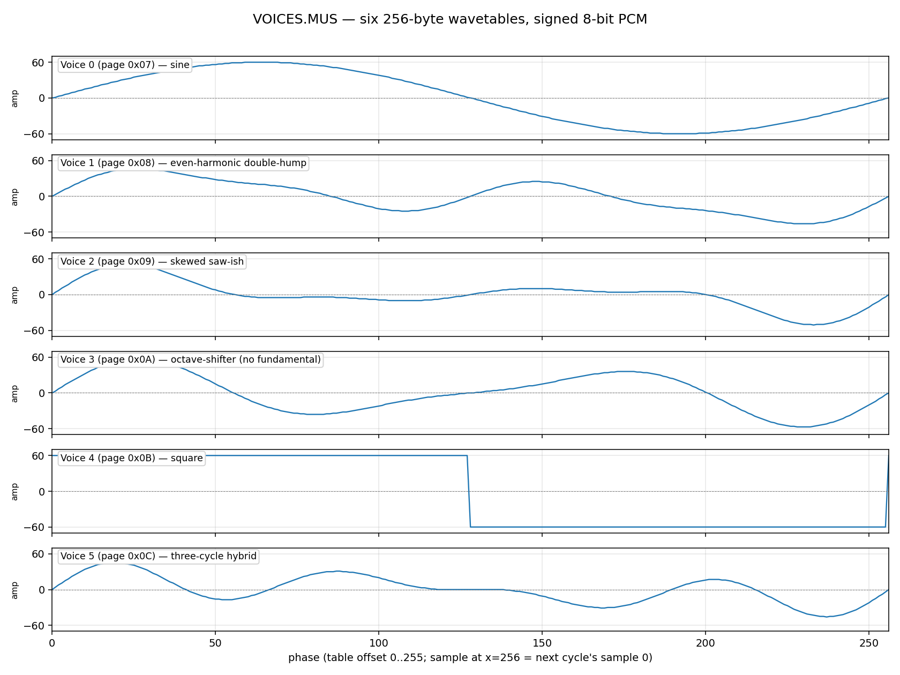

# `VOICES.MUS` — Wavetable Bank Analysis

Companion to [`PLAY_COM_ANALYSIS.md`](PLAY_COM_ANALYSIS.md). That doc covers the
synth engine; this one covers the timbre data that engine reads.

- **File:** `MUSIC/music.unpacked/0/VOICES.MUS`
- **Size:** 1536 bytes (= 6 × 256)
- **Format:** raw concatenated single-cycle wavetables, signed 8-bit PCM, no
  header, no trailer
- **Loaded by PLAY.COM:** once, at startup, to a page-aligned address
  (`0x0700` in the standard build); referenced thereafter by the high byte of
  each table's address (one page per wavetable)

---

## Conventions

This document uses these terms with strict consistency.

- **Part** — one of PLAY.COM's 4 simultaneous playback slots. The
  player names them "Parts" in its own UI ("New voice for Part 1?").
  Each Part has its own phase accumulator, pitch (`step`), and chosen
  wavetable. Numbered **1–4**.
- **Wavetable** (a.k.a. **timbre**, a.k.a. **voice**) — one of the 6
  256-byte single-cycle waveforms bundled in this file. There are
  always **6** wavetables. Internal indexing is 0–5 (matching the byte
  encoding `0x81 + idx` in the song stream); human-readable references
  can be 1–6 — same things. The three synonyms are interchangeable in
  this document, but **never** use "voice" to mean a Part.
- **DAC** — Digital-to-Analog Converter. PLAY.COM uses 2 of the 7
  analog DACs on the Cromemco D+7A I/O card: port `19h` (DAC 1) and
  port `1Bh` (DAC 2).
- **Mix** — software addition of two Parts' 8-bit signed samples into
  one DAC byte before the `OUT`. Produces an audio sum of both Parts
  at once, not a synthesized hybrid timbre.

DAC routing in PLAY.COM:

```
Parts 1 + 2 ── software sum ──> DAC 1 (port 19h)
Parts 3 + 4 ── software sum ──> DAC 2 (port 1Bh)
```

The two DAC outputs are wired together externally into a single mono
audio stream; PLAY.COM is not a stereo program.

---

## 1. Wavetables vs. Parts — relationship

PLAY.COM has **4 simultaneous Parts** (Parts 1–4); this file holds **6
wavetables** (numbered 0..5). Each Part independently picks one
wavetable, so any chord can use any combination — including all four
Parts playing the same wavetable or four different ones.

In the song-stream byte encoding, the wavetable a Part should use is
written as `0x81 + idx` (range `0x81..0x86`). The dispatcher subtracts
a runtime-computed "wavetable offset" so that the result is the actual
page byte where the chosen wavetable lives in RAM. See
[`PLAY_COM_ANALYSIS.md`](PLAY_COM_ANALYSIS.md) §6.1 for the relocation
trick.

---

## 2. File layout

```
offset   table   page (default load addr)
+0x000   voice 0   0x07
+0x100   voice 1   0x08
+0x200   voice 2   0x09
+0x300   voice 3   0x0A
+0x400   voice 4   0x0B
+0x500   voice 5   0x0C
```

Every table is exactly 256 entries. The player's inner loop uses
`LD L,H` (high byte of phase → low byte of pointer) and `LD H, page`
followed by `LD A,(HL)` — one cycle through `phase16` covers the table
exactly once, regardless of pitch.

---

## 3. Summary table

| # | Page | Peak | RMS | DC | Zero-crossings | Character |
|---|------|-----:|----:|---:|---------------:|-----------|
| 0 | 0x07 | ±60 | 42.4 | 0.00 | 2 | Pure sine |
| 1 | 0x08 | ±46 | 26.5 | 0.00 | 4 | Asymmetric double-hump (even-harmonic-dominant) |
| 2 | 0x09 | ±51 | 22.9 | 0.00 | 4 | Skewed saw-ish, broad H1–H4 spectrum |
| 3 | 0x0A | ±57 | 31.6 | 0.00 | 4 | Octave-shifter — H1 ≈ 0, H2 dominant |
| 4 | 0x0B | ±60 | 60.0 | 0.00 | 2 | Pure square wave |
| 5 | 0x0C | ±46 | 22.6 | 0.00 | 6 | Three-cycles-per-period; sounds ~12th above nominal |

**Notes on the columns:**
- *Peak* is the larger of `|max|` and `|min|` across the 256 samples.
- *RMS* over one full cycle. RMS = peak for a square wave, peak/√2 ≈ 0.707·peak
  for a sine. Voice 0 and 4 hit those identities exactly.
- *DC* is the mean of the 256 samples. All six tables have DC = 0
  to within rounding — they were hand-balanced.
- *Zero-crossings* count sign changes within the 256-sample period. ZC=2 means
  one true cycle; ZC=4 means the waveform's audible top harmonic doubles
  (apparent pitch up an octave); ZC=6 → triples (octave + fifth).

---

## 4. Spectral analysis

Magnitudes of the first 8 harmonics (DFT, single-cycle, full-amplitude):

```
V  Page   H1    H2    H3    H4    H5    H6    H7    H8
0  0x07  59.9   0.0   0.1   0.0   0.1   0.0   0.0   0.0
1  0x08  20.0  30.0   0.0  10.1   0.0   0.0   0.0   0.0
2  0x09  10.1  24.9  15.0  10.1   0.1   0.0   0.0   0.0
3  0x0A   0.0  40.0  20.0   0.1   0.0   0.0   0.0   0.0
4  0x0B  76.4   0.0  25.5   0.0  15.3   0.0  10.9   0.0
5  0x0C  15.0   0.0  20.0  19.9   0.1   0.0   0.0   0.0
```

Observations:

- **Voice 0 is a textbook sine.** Only H1 above the noise floor.
- **Voice 4 is a textbook square.** H1=76.4, H3=25.5, H5=15.3, H7=10.9 — that's
  the 1, 1/3, 1/5, 1/7 series of an ideal odd-harmonic square wave, scaled by
  4·peak/π ≈ 76.4. Even harmonics are exactly 0.
- **Voice 3 has *no* fundamental.** H1 ≈ 0 with H2 dominant. Played notes will
  sound an octave above their nominal pitch — useful for high-register parts
  without burning a whole 16-bit step on it.
- **Voice 5 has H3 + H4 dominant** with no H2. The mix of an odd and an even
  upper harmonic gives it a hollow, slightly clangy character.
- **Voices 1 and 2 are "filled-in" timbres** — H2 dominant but with enough
  surrounding harmonics to read as full-bodied rather than pure-octave-shifted.

---

## 5. Waveform shapes

All six wavetables on a shared phase axis (rendered by [`plot_voices.py`](plot_voices.py)):



ASCII renders below for environments without image support, each at 64 horizontal × ~30 vertical resolution
(`x` = phase, `y` = sample value, zero axis dashed):

### Voice 0 — sine (page 0x07)

```
+----------------------------------------------------------------+
|                                                                |
|              *****                                             |
|            **     **                                           |
|          **         **                                         |
|         *             *                                        |
|        *               *                                       |
|       *                 *                                      |
|      *                   *                                     |
|     *                     *                                    |
|                                                                |
|    *                       *                                   |
|   *                         *                                  |
|  *                           *                                 |
|                                                                |
| *                             *                                |
|*-------------------------------*-------------------------------|
|                                 *                             *|
|                                                                |
|                                  *                           * |
|                                   *                         *  |
|                                    *                       *   |
|                                                                |
|                                     *                     *    |
|                                      *                   *     |
|                                       *                 *      |
|                                        *               *       |
|                                         *             *        |
|                                          **         **         |
|                                            **     **           |
|                                              *****             |
|                                                                |
+----------------------------------------------------------------+
```

### Voice 1 — even-harmonic double-hump (page 0x08)

```
+----------------------------------------------------------------+
|                                                                |
|                                                                |
|                                                                |
|                                                                |
|      **                                                        |
|     *  **                                                      |
|    *     *                                                     |
|   *       *                                                    |
|            *                                                   |
|             **                     ***                         |
|  *            **                  *   *                        |
|                 **               *     *                       |
| *                 *                                            |
|                    *            *       *                      |
|                                          *                     |
|*--------------------*----------*----------*--------------------|
|                      *                                         |
|                       *       *            *                   |
|                                             *                 *|
|                        *     *               **                |
|                         *   *                  **            * |
|                          ***                     **            |
|                                                    *        *  |
|                                                     *          |
|                                                      *     *   |
|                                                       **  *    |
|                                                         **     |
|                                                                |
|                                                                |
|                                                                |
|                                                                |
+----------------------------------------------------------------+
```

### Voice 2 — skewed saw-ish (page 0x09)

```
+----------------------------------------------------------------+
|                                                                |
|                                                                |
|                                                                |
|     **                                                         |
|    *  *                                                        |
|        *                                                       |
|   *                                                            |
|         *                                                      |
|                                                                |
|  *       *                                                     |
|                                                                |
|           *                                                    |
| *          *                                                   |
|                                   ******                       |
|             *                   **      *********              |
|*-------------*-----------------*-----------------*-------------|
|               *********      **                   *            |
|                        ******                                  |
|                                                    *          *|
|                                                     *          |
|                                                                |
|                                                      *       * |
|                                                                |
|                                                       *        |
|                                                             *  |
|                                                        *       |
|                                                         *  *   |
|                                                          **    |
|                                                                |
|                                                                |
|                                                                |
+----------------------------------------------------------------+
```

### Voice 3 — octave-shifter (page 0x0A)

```
+----------------------------------------------------------------+
|                                                                |
|                                                                |
|      ***                                                       |
|     *                                                          |
|    *    *                                                      |
|          *                                                     |
|   *                                                            |
|                                          *****                 |
|           *                             *                      |
|  *                                     *      *                |
|            *                          *        *               |
|                                      *                         |
| *                                   *           *              |
|             *                     **                           |
|                                  *                             |
|*-------------*----------------***----------------*-------------|
|                              *                                 |
|                            **                     *            |
|               *           *                                   *|
|                          *                                     |
|                *        *                          *           |
|                 *      *                                     * |
|                  *    *                             *          |
|                   ****                                         |
|                                                             *  |
|                                                      *         |
|                                                       *    *   |
|                                                           *    |
|                                                        ***     |
|                                                                |
|                                                                |
+----------------------------------------------------------------+
```

### Voice 4 — square (page 0x0B)

```
+----------------------------------------------------------------+
|                                                                |
|********************************                                |
|                                                                |
|                                                                |
|                                                                |
|                                                                |
|                                                                |
|                                                                |
|                                                                |
|                                                                |
|                                                                |
|                                                                |
|                                                                |
|                                                                |
|                                                                |
|----------------------------------------------------------------|
|                                                                |
|                                                                |
|                                                                |
|                                                                |
|                                                                |
|                                                                |
|                                                                |
|                                                                |
|                                                                |
|                                                                |
|                                                                |
|                                                                |
|                                                                |
|                                ********************************|
|                                                                |
+----------------------------------------------------------------+
```

### Voice 5 — three-cycle hybrid (page 0x0C)

```
+----------------------------------------------------------------+
|                                                                |
|                                                                |
|                                                                |
|                                                                |
|     *                                                          |
|    * *                                                         |
|   *                                                            |
|       *                                                        |
|  *                  ***                                        |
|        *           *   *                                       |
|                   *     *                                      |
| *                                                **            |
|         *        *       *                      *  *           |
|                           *                         *          |
|                 *          *                   *               |
|*---------*------------------*******------------------*---------|
|                *                   *          *                |
|           *                         *                          |
|            *  *                      *       *        *        |
|             **                                                *|
|                                       *     *                  |
|                                        *   *           *       |
|                                         ***                  * |
|                                                         *      |
|                                                             *  |
|                                                          * *   |
|                                                           *    |
|                                                                |
|                                                                |
|                                                                |
|                                                                |
+----------------------------------------------------------------+
```

---

## 5b. Wrap-point design — odd symmetry and clean looping

All six wavetables are **odd-symmetric around the period boundary**:

```
samples[N - i] == -samples[i]     for every i, with N = 256
```

This is verified empirically (256/256 matches for every voice in
[`check_symmetry.py`](check_symmetry.py)) and has three consequences worth
recording:

**1. Clean wrap with no doubled zero.** The phase accumulator runs
`0, 1, ..., 255, 0, 1, ...` — there is no "sample 256". The values at
samples 1 and 255 are equal in magnitude and opposite in sign (e.g. voice 0
has s[1]=+1, s[255]=-1; voice 2 has s[1]=+4, s[255]=-4). So in playback
the sequence around the wrap is

```
..., -2k, -k, 0, +k, +2k, ...
       ^^   ^^  ^^  ^^
     s[254] s[255] s[0] s[1]
```

Zero is sampled **exactly once per cycle**, at s[0]. If s[255] had been
zero too, the DAC would briefly plateau at 0 V across the wrap — a slope
discontinuity that would show up as extra spectral content. The small
non-zero value at s[255] is *intentional*: it keeps the slope continuous
across the loop boundary.

**2. The "second half goes backwards in time" effect.** Odd symmetry
implies `s[128 + k] == -s[128 - k]`, i.e. the second half of every table
is the first half played in reverse with sign flipped. This is invisible
on voices 0, 1, 2, 4, 5 because their first halves are themselves nearly
symmetric. It's plainly visible on voice 3, whose first half is asymmetric
(sharp peak at phase 24, slow shallow dip at phase 80) — the second half
is that pattern reversed (slow shallow peak at phase 176, sharp trough at
phase 232).

**3. Zero DC by construction.** Odd symmetry around the period boundary
forces the integral over one period to be zero, hence
`mean(samples) == 0` for every voice (confirmed in §3).

Together these three properties are the fingerprint of synthesizing each
voice as a pure **sine series** with no cosine and no DC term:

```
samples[i] = round(sum_k a_k * sin(2*pi*k*i/256))
```

The choice of `a_k` coefficients (the harmonic mix) is what differentiates
the six voices — the mathematical structure is the same.

**Wrap-jump magnitudes:**

| Voice | s[0] | s[255] | wrap \|s[0] − s[255]\| |
|:------|-----:|-------:|------------------------:|
| 0 sine | 0 | -1 | 1 |
| 1 | 0 | -3 | 3 |
| 2 | 0 | -4 | 4 |
| 3 | 0 | -3 | 3 |
| 4 square | +60 | -60 | **120** (intentional — square's rising edge) |
| 5 | 0 | -4 | 4 |

Voice 4's 120-unit jump is by design — square waves are *defined* by their
±transitions; the rising edge at the wrap and the falling edge at phase
127→128 are what produce the odd-harmonic series in §4.

---

## 6. Design observations

**Headroom is deliberate.** PLAY.COM mixes two Parts into one DAC byte by
software addition (`ADD A,(HL)`). The 8-bit DAC range is ±127. Each
wavetable's peak is ≤ 60, so the worst-case sum of two Parts is ±120 —
never clips. Wavetable 4 (square, peak ±60) is the loudest choice;
two Parts both using wavetable 4 on the same DAC is the only
configuration that reaches ±120. Anything quieter gets enough headroom
to forgive constructive overlap.

**Even/odd harmonic balance is biased toward even.** Of the 6 timbres, only
voices 0 (sine) and 4 (square) follow the textbook patterns. The other four
(1, 2, 3, 5) all have a strong even-harmonic component, often with H2
matching or exceeding H1. That gives the bank a distinctive "octave above
the note you played" character on most timbres — likely intentional, to make
melodies sound bright on the small Cromemco speaker without needing a pitch
shift in the song data.

**Voices 3 and 5 are perceptual pitch-shifters.** Because their fundamentals
are weak or absent, the ear locks onto the dominant overtone:
- Voice 3 → effective +12 semitones (octave) from H2
- Voice 5 → effective +19 semitones (octave + fifth) from H3

This is useful because the song format only has 16-bit phase increments per
Part; using a high-octave wavetable extends the achievable pitch range
without costing a separate scaling pass.

**No noise channel, no envelopes.** Every timbre is a single fixed-amplitude
periodic wave. Articulation and dynamics come entirely from note duration
and chord choice — there's no decay/sustain/release shape to be had.
Compositions exploit this by using shorter durations to imply staccato.

**No anti-aliasing.** The square wave (voice 4) has a perfectly vertical edge
in the table, so it produces all the aliases you'd expect when read out at
8 kHz. At low pitches this is fine; up high you'll hear the harmonics fold.

---

## 7. Authoring implications

When using `compose.py` to author a `.MUS` file:

- The wavetable byte for each Part is `0x81 + n`. Validated values:
  `0x81..0x86`.
- For "lead" lines that should cut through, wavetable 4 (square) gives
  the loudest signal and the most distinctive timbre.
- For high-register lines that don't have step-precision room, wavetables
  3 (octave-up) and 5 (octave + fifth) are free pitch-shifters.
- For pad-like sustained chords, wavetable 0 (sine) keeps headroom and
  avoids intermodulation when summed with another Part on the same DAC.
- Pairing wavetable 4 (square) with wavetable 0 (sine) on the same DAC
  is safe; two Parts both using wavetable 4 on the same DAC approach
  but do not exceed clip.

The simulator (`simulate.py`) reads VOICES.MUS the same way the player does
and was validated bit-exact against captured hardware on `BACH8.MUS`. If a
.MUS sounds right under `simulate.py`, it will sound right on the IMSAI.

---

## 8. Reproduction

Two scripts in this directory reproduce the analysis above:

- [`analyze_voices.py`](analyze_voices.py) — numerical summary, per-voice ASCII
  table dump, harmonic magnitudes, single-cycle WAV renders at 220 Hz, and a
  combined CSV (`voices_analysis/all_voices.csv`).
- [`sparkline_voices.py`](sparkline_voices.py) — ASCII shape plots reproduced
  in §5.
- [`plot_voices.py`](plot_voices.py) — matplotlib stacked-subplot rendering
  (PNG + SVG) of all 6 wavetables on a shared phase axis.

Output files land in `voices_analysis/` next to VOICES.MUS.

---

## 8b. How the wavetables are pitched

A wavetable is a *single-cycle* waveform — playing it back at a different
speed = playing a different note. PLAY.COM accomplishes that with a 16-bit
phase accumulator per Part; only the high 8 bits index the wavetable, so
phase advances of less than one wavetable entry still accumulate
correctly.

Per Part, per sample tick:

```
phase16 = phase16 + step16             ; 16-bit add, wraps at 65536
sample  = wavetable[phase16 >> 8]      ; high byte indexes the table
```

The output frequency is `step × Fs / 65536` where `Fs ≈ 8000 Hz`. So:

```
step  =  round(freq × 65536 / Fs)  =  round(freq × 8.192)    at Fs=8kHz
```

Some reference values:

| Note | Step (decimal) | Step (hex) |
|------|---------------:|:-----------|
| A2   |  901 | 0x0385 |
| A3   | 1802 | 0x070A |
| **A4** | **3604** | **0x0E14** |
| A5   | 7209 | 0x1C29 |
| A6   | 14418 | 0x3852 |

**Octave = ×2 step.** Going up an octave is exactly a 1-bit shift — and
this is also why **wavetables 3 and 5 act as free octave-shifters**:
their fundamentals are missing or weak, so the perceived pitch is the
dominant overtone (H2 for wavetable 3, H3 for wavetable 5). Same step
value, +1 octave or +octave-fifth of perceived pitch. The composer can
transpose a Part up without changing any note data, just by switching
its wavetable byte.

**Pitch resolution** is `Fs/65536 ≈ 0.122 Hz` per step — about 1/200 of a
semitone at A4. Way below the ear's threshold.

**Aliasing at high pitches.** A4 advances ~14 wavetable entries per
sample; C7 skips ~50. Sharp-edged wavetables (wavetable 4 = square)
alias audibly above the upper register; smooth wavetables (wavetable
0 = sine) stay clean. Choosing per-Part wavetable is the composer's
tool for keeping the high register from going hashy.

Full coverage of pitch generation, including the inner-loop machine
code that reads each wavetable, is in
[`PLAY_COM_ANALYSIS.md`](PLAY_COM_ANALYSIS.md) §3.3 and §3.4.

---

## 9. Cross-references

- Player engine internals — [`PLAY_COM_ANALYSIS.md`](PLAY_COM_ANALYSIS.md)
- Disassembly — [`PLAY.lst`](PLAY.lst)
- Disassembler — [`disasm.py`](disasm.py)
- Song authoring toolchain — [`compose.py`](compose.py),
  [`decode_mus.py`](decode_mus.py), [`simulate.py`](simulate.py)
